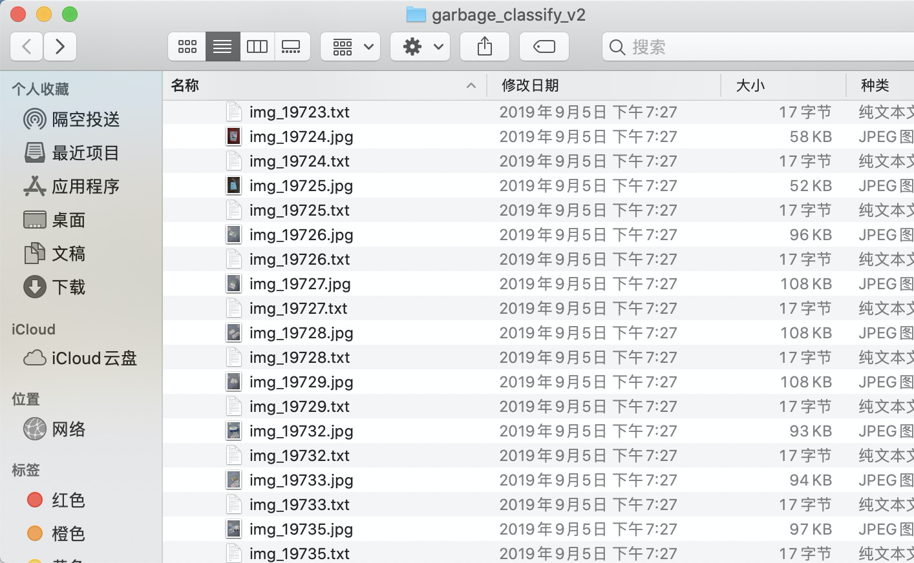
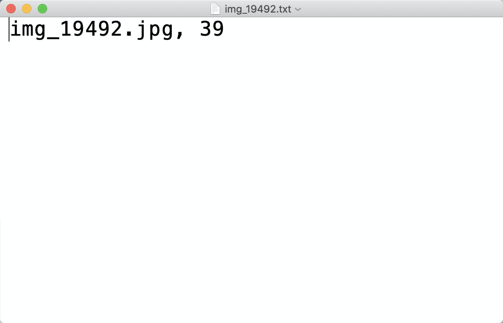
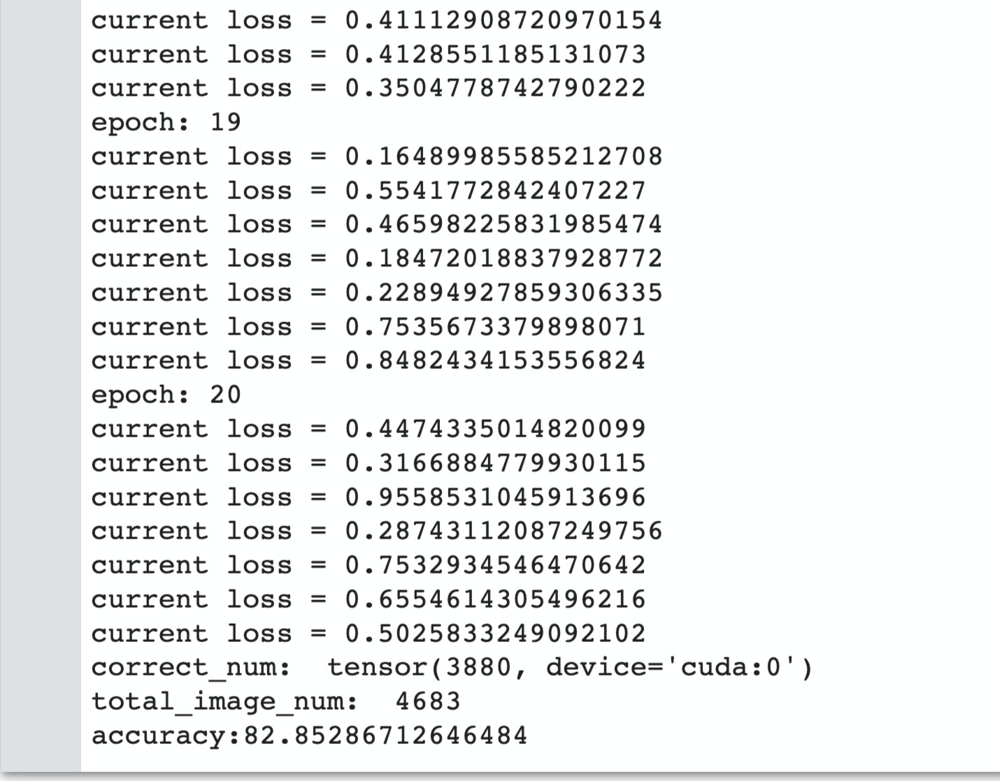

# garbage_classify

## 赛题背景

该赛题来自华为云，目前比赛已经结束了。

如今，垃圾分类已成为社会热点话题。其实在2019年4月26日，我国住房和城乡建设部等部门就发布了《关于在全国地级及以上城市全面开展生活垃圾分类工作的通知》，决定自2019年起在全国地级及以上城市全面启动生活垃圾分类工作。到2020年底，46个重点城市基本建成生活垃圾分类处理系统。

人工垃圾分类投放是垃圾处理的第一环节，但能够处理海量垃圾的环节是垃圾处理厂。然而，目前国内的垃圾处理厂基本都是采用人工流水线分拣的方式进行垃圾分拣，存在工作环境恶劣、劳动强度大、分拣效率低等缺点。在海量垃圾面前，人工分拣只能分拣出极有限的一部分可回收垃圾和有害垃圾，绝大多数垃圾只能进行填埋，带来了极大的资源浪费和环境污染危险。

随着深度学习技术在视觉领域的应用和发展，让我们看到了利用AI来自动进行垃圾分类的可能，通过摄像头拍摄垃圾图片，检测图片中垃圾的类别，从而可以让机器自动进行垃圾分拣，极大地提高垃圾分拣效率。

因此，华为云面向社会各界精英人士举办了本次垃圾分类竞赛，希望共同探索垃圾分类的AI技术，为垃圾分类这个利国利民的国家大计贡献自己的一份智慧。

## 赛题说明
本赛题采用深圳市垃圾分类标准，赛题任务是对垃圾图片进行分类，即首先识别出垃圾图片中物品的类别（比如易拉罐、果皮等），然后查询垃圾分类规则，输出该垃圾图片中物品属于可回收物、厨余垃圾、有害垃圾和其他垃圾中的哪一种。
模型输出格式示例：
    
    {
    
        " result ": "可回收物/易拉罐"
    
    }

## 垃圾种类40类

    {
        "0": "其他垃圾/一次性快餐盒",
        "1": "其他垃圾/污损塑料",
        "2": "其他垃圾/烟蒂",
        "3": "其他垃圾/牙签",
        "4": "其他垃圾/破碎花盆及碟碗",
        "5": "其他垃圾/竹筷",
        "6": "厨余垃圾/剩饭剩菜",
        "7": "厨余垃圾/大骨头",
        "8": "厨余垃圾/水果果皮",
        "9": "厨余垃圾/水果果肉",
        "10": "厨余垃圾/茶叶渣",
        "11": "厨余垃圾/菜叶菜根",
        "12": "厨余垃圾/蛋壳",
        "13": "厨余垃圾/鱼骨",
        "14": "可回收物/充电宝",
        "15": "可回收物/包",
        "16": "可回收物/化妆品瓶",
        "17": "可回收物/塑料玩具",
        "18": "可回收物/塑料碗盆",
        "19": "可回收物/塑料衣架",
        "20": "可回收物/快递纸袋",
        "21": "可回收物/插头电线",
        "22": "可回收物/旧衣服",
        "23": "可回收物/易拉罐",
        "24": "可回收物/枕头",
        "25": "可回收物/毛绒玩具",
        "26": "可回收物/洗发水瓶",
        "27": "可回收物/玻璃杯",
        "28": "可回收物/皮鞋",
        "29": "可回收物/砧板",
        "30": "可回收物/纸板箱",
        "31": "可回收物/调料瓶",
        "32": "可回收物/酒瓶",
        "33": "可回收物/金属食品罐",
        "34": "可回收物/锅",
        "35": "可回收物/食用油桶",
        "36": "可回收物/饮料瓶",
        "37": "有害垃圾/干电池",
        "38": "有害垃圾/软膏",
        "39": "有害垃圾/过期药物"
    }

## 数据集

1，[垃圾分类数据集下载地址](https://modelarts-competitions.obs.cn-north-1.myhuaweicloud.com/garbage_classify/dataset/garbage_classify.zip)

2，train_data_v2文件夹内有14683张图片，该文件夹内每张图片，对应一个txt文件。

txt文件中有图像的名称和标签。

## 

## Baseline

1，整理数据集内的txt文件，分出训练集和测试集，严谨一些，应该分出训练、验证、测试集。遍历所有的txt文件，选择10000张图片作为训练机，剩下的图片作为测试集。

2，计算训练集图片的均值和方差。

3，pytorch自带数据集，也可用不是自带的数据集，这类数据集，创建自己的类：MyDataset, 继承pytorch中的 Dataset类。

4，使用预训练模型ResNet50，accuracy:82.85286712646484

### BaseLine改进

请听下回分解～

